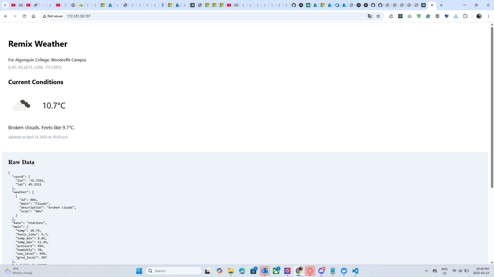
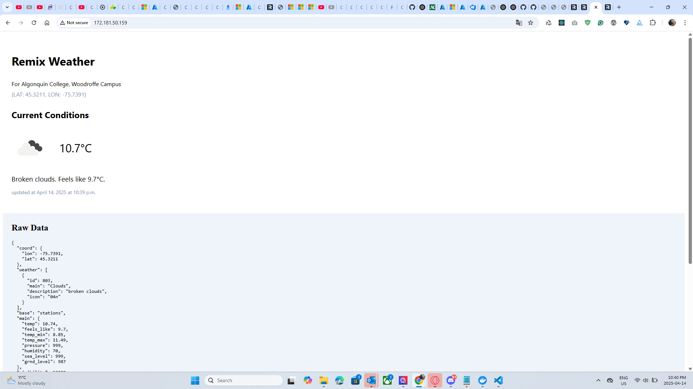
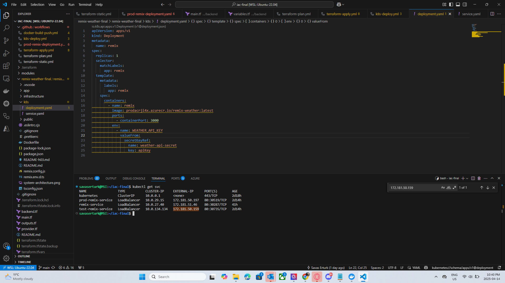
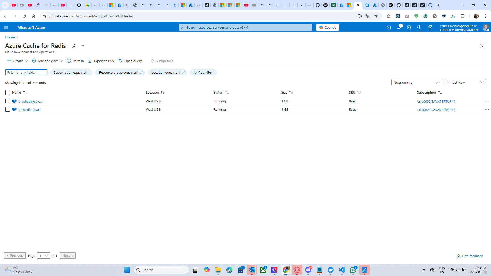

# CST8918 Final Project: Weather App with Azure AKS

This project demonstrates Infrastructure as Code (IaC) using Terraform to deploy a Remix Weather Application on Azure Kubernetes Service (AKS) with Azure Cache for Redis.

## Team Members

- Savas Erturk (GitHub: savaserturk])
- Rohan James Scott (GitHub: scot8)
- Khanh Duy Truong (GitHub: duytk1)
- Ben Yee GitHub: (GitHub: BenYee15)

## Prerequisites

- Azure CLI
- Terraform
- kubectl
- Docker
- GitHub CLI (optional)

## Setup Instructions

1. Clone the repository
2. Install dependencies
3. Configure Azure credentials
4. Initialize Terraform
5. Apply infrastructure changes


## 🧱 Infrastructure Modules

### ✔ Backend Configuration (Remote State)
- ✅ Azure Blob Storage used as the remote backend for storing Terraform state files
- ✅ State locking enabled for safe collaboration

### ✔ Network Module
- ✅ Created a Virtual Network with CIDR block `10.0.0.0/14`
- ✅ Subnets created for different environments:
  - `prod`: `10.0.0.0/16`
  - `test`: `10.1.0.0/16`
  - `dev`: `10.2.0.0/16`
  - `admin`: `10.3.0.0/16`

### ✔ AKS Module
- ✅ **Test Cluster**:
  - 1 static node
  - Kubernetes version `v1.32.0`
- ✅ **Prod Cluster**:
  - Autoscaling enabled (1–3 nodes)
  - Kubernetes version `v1.32.0`
- ✅ System-assigned managed identity configured
- ✅ ACR integration for pulling container images

### ✔ Weather App Module
- ✅ Remix Weather App Dockerized and deployed to AKS
- ✅ Azure Container Registry (ACR) setup and connected
- ✅ Redis Cache provisioned and integrated for both test and prod
- ✅ Kubernetes `Deployment` and `LoadBalancer` Service created per environment

---

## ⚙️ GitHub Actions Workflows

All CI/CD pipelines have been implemented and tested:

- ✅ **`docker-build-push.yml`**  
  Builds and pushes Docker images to ACR on PR and main branch push

- ✅ **`terraform-static.yml`**  
  Runs `terraform fmt`, `validate`, and `tfsec` on all pushes

- ✅ **`terraform-plan.yml`**  
  Executes `tflint` and generates Terraform plan on pull requests

- ✅ **`terraform-apply.yml`**  
  Applies infrastructure changes on push to main

- ✅ **`k8s-deploy.yml`**  
  Automatically deploys the updated Remix app to AKS test/prod clusters

These workflows ensure full automation from code commit to cloud deployment.

## 📷 Application Screenshots

### 🌐 Production Environment


### 🧪 Test Environment


### 🖥️ Kubernetes Services via Terminal


### 🖥️ Redis Deployment on Azure


## 📸 Submission Checklist

- [x] GitHub repo submitted on Brightspace
- [x] Professor `rlmckenney` added as collaborator
- [x] Add screenshot of successful GitHub Action workflows
- [x] Include all required workflows in `.github/workflows/`

---

## 🔥 Cleanup

To avoid unnecessary Azure charges, run:

```bash
terraform destroy
```

After confirming your deployment and submitting the project.

---

## 📜 License

This project is for educational purposes only as part of CST8918: DevOps – Infrastructure as Code.
